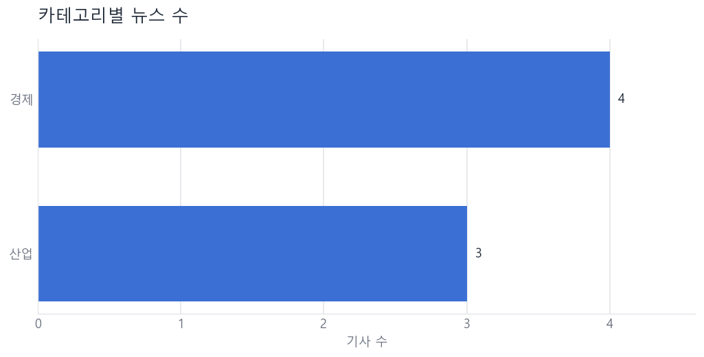
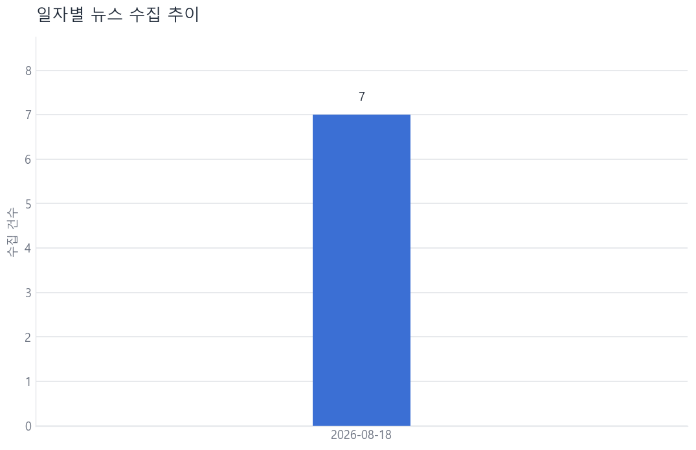
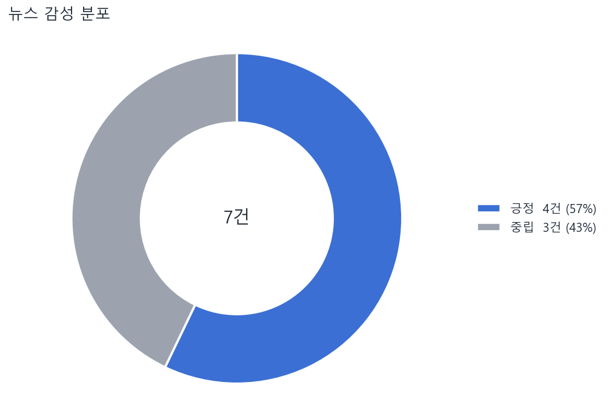

# NewsBot 실행 결과 모음

CLI 애플리케이션의 전 서브커맨드를 **연합뉴스 실데이터**로 실행한 기록입니다.
아래 콘솔 출력은 실제 실행 결과를 그대로 옮긴 것입니다.

| 항목 | 값 |
|---|---|
| 실행 일시 | 2026-08-18 11:01 ~ 11:23 (KST) |
| 실행 환경 | Windows 11 · Python 3.14 |
| 뉴스 소스 | 연합뉴스 (`https://www.yna.co.kr`) |
| 수집 카테고리 | 경제, 산업, 정치 |
| AI 제공자 | `mock` (규칙 기반) — API 키 미등록 상태 |
| 저장소 | SQLite `data/newsbot.db` |

> AI 계층은 제공자 중립으로 설계돼 있어, 환경변수에 API 키를 넣으면 코드 수정 없이
> Gemini / OpenAI / Anthropic 실제 호출로 전환됩니다. 키가 없는 동안은 규칙 기반
> 대체 구현이 동작하며 결과에 `[mock]` 표시가 남습니다.

---

## 실행 요약

| # | 명령 | 결과 |
|---:|---|---|
| 1 | `fetch --category 경제,산업 --limit 6 --method all` | RSS 6건 + 크롤링 6건 = **raw 12건** |
| 2 | `clean` | 신규 7건 / **중복 5건 skip** |
| 3 | `summarize --unsummarized --limit 5` | **5건 성공** (1,541자 → 195자) |
| 4 | `analyze` | 트렌드·키워드·공통점·시사점 4항목 저장 |
| 5 | `report --format md` | 품질지표 5종 + TOP N 3종 + 차트 3장 |
| 6 | `export --format all --status summarized` | CSV / JSONL / XLSX 3종 |
| 7 | `sentiment` | **7건 분석** (긍정 4 · 중립 3) |
| 8 | `list` / `show` | 필터·페이지네이션·상세 조회 |

---

## 1. `fetch` — 뉴스 수집 (RSS + 크롤링)

```
$ python main.py fetch --category 경제,산업 --limit 6 --method all

[INFO] 뉴스 수집 시작: source=yna, method=all, limit=6, 카테고리=경제, 산업
[INFO] RSS 요청: 경제 (https://www.yna.co.kr/rss/economy.xml)
[INFO] RSS 수집 [경제]: 3건
[INFO] RSS 요청: 산업 (https://www.yna.co.kr/rss/industry.xml)
[INFO] RSS 수집 [산업]: 3건
[INFO] 목록 페이지 크롤링: 경제 (https://www.yna.co.kr/economy/all)
[INFO] 크롤링 수집 [경제]: 3건
[INFO] 목록 페이지 크롤링: 산업 (https://www.yna.co.kr/industry/all)
[INFO] 크롤링 수집 [산업]: 3건
[INFO] 수집 완료: 12건 성공, 0건 실패
[INFO] raw 저장소에 저장 완료 (누적 12건)
```

**확인된 것**

- **방법 1 (RSS)** — `yna.co.kr/rss/{category}.xml` 피드에서 구조화된 메타데이터 수집
- **방법 2 (크롤링)** — `yna.co.kr/{category}/all` 목록 페이지 → 기사 상세 페이지를 BeautifulSoup 로 파싱
- 두 방법 모두 동일한 HTTP 계층(타임아웃 10초 · 재시도 2회 · 요청 간 1초 지연 · robots.txt 확인)을 통과
- 원본은 수집 시각 · 소스 · 수집 방법과 함께 `raw_news` 테이블에 append-only 로 적재

카테고리 목록 조회도 지원합니다.

```
$ python main.py fetch --list-categories

[연합뉴스] 사용 가능한 카테고리
  - 정치
  - 경제
  - 산업
  - 국제
  - 사회
  - 문화
  - 연예
  - 스포츠
  - 건강
  - 지역
  - 증권 (RSS 전용)
  - 전체 (RSS 전용)

기본 카테고리: 경제, 산업, 정치, 국제
```

---

## 2. `clean` — 정제 및 중복 처리

```
$ python main.py clean

[INFO] 정제 시작: 12건 (중복 정책=skip)
[INFO] 정제 완료: 신규 7건, 갱신 0건, 중복 5건, 폐기 0건
```

RSS 와 크롤링이 **같은 기사를 양쪽에서 가져온 5건**이 URL 해시 기준으로 걸러졌습니다.
중복 정책이 실제로 동작함을 보여주는 결과입니다.

`upsert` 정책과 전체 재처리도 확인했습니다.

```
$ python main.py clean --on-duplicate upsert --reprocess

[INFO] 정제 시작: 12건 (중복 정책=upsert, 전체 재처리)
[INFO] 정제 완료: 신규 0건, 갱신 12건, 중복 0건, 폐기 0건
```

> `--reprocess` 는 **네트워크 요청 없이** raw 12건을 전량 재처리합니다.
> raw/clean 을 분리 저장한 실질적인 이득입니다 — 정제 규칙을 바꿔도 재수집이 필요 없습니다.
> 이때 본문이 실제로 바뀌지 않은 기사의 **기존 요약·감성 결과는 보존**되어 AI 재호출이 발생하지 않았습니다.

---

## 3. `summarize` — AI 요약

```
$ python main.py summarize --unsummarized --limit 5

[WARNING] AI API 키가 없어 mock(규칙 기반) 모드로 동작합니다. 실제 AI 요약/분석을 쓰려면
          환경변수에 API 키를 설정하세요: GEMINI_API_KEY, OPENAI_API_KEY, ANTHROPIC_API_KEY
[INFO] 요약 대상: 5건 (모델=mock:mock-rule-based, 최대 200자)
[INFO] [1/5] ID=7 요약 완료 (181자 → 181자)
[INFO] [2/5] ID=4 요약 완료 (1541자 → 195자)
[INFO] [3/5] ID=5 요약 완료 (626자 → 195자)
[INFO] [4/5] ID=6 요약 완료 (523자 → 185자)
[INFO] [5/5] ID=1 요약 완료 (1119자 → 193자)
[INFO] 요약 완료: 5건 성공, 0건 실패, 0건 스킵
```

대상 선택 옵션 3종을 모두 확인했습니다.

```
$ python main.py summarize --all --limit 3 --dry-run --force
[INFO] 요약 대상: 3건 (모델=mock:mock-rule-based, 최대 200자)
[INFO] [1/3] ID=7 (dry-run) 호출 생략
[INFO] [2/3] ID=4 (dry-run) 호출 생략
[INFO] [3/3] ID=5 (dry-run) 호출 생략
[INFO] 요약 완료: 0건 성공, 0건 실패, 3건 스킵

$ python main.py summarize --id 2 --provider mock --max-chars 100
[INFO] 요약 대상: 1건 (모델=mock:mock-rule-based, 최대 100자)
[INFO] [1/1] ID=2 요약 완료 (799자 → 90자)
[INFO] 요약 완료: 1건 성공, 0건 실패, 0건 스킵
```

- 이미 요약된 뉴스는 기본 스킵 (`--force` 로 재요약)
- API 실패는 로깅 후 **해당 건만 스킵**, 전체 배치는 계속 진행

---

## 4. `analyze` — AI 인사이트 분석

```
$ python main.py analyze

[INFO] 분석 대상: 7건
[INFO] AI 분석 요청 중... (mock:mock-rule-based)
[INFO] 분석 완료 (analysis_id=2)

=== AI 인사이트 분석 결과 ===
카테고리: 전체 | 대상: 7건 | 모델: mock-rule-based

[총평]
[mock] 총 7건을 규칙 기반으로 집계했습니다. 최다 카테고리 '경제', 최다 키워드 '만원'.

[핵심 키워드]
만원, 비중, 천만원, 국방부, 한화투자증권, 캠페인, 서울, 명이

[주요 트렌드]
- [mock] '만원' 관련 보도가 10회 등장하며 기간 내 비중이 높습니다.
- [mock] '비중' 관련 보도가 4회 등장하며 기간 내 비중이 높습니다.
- [mock] '천만원' 관련 보도가 4회 등장하며 기간 내 비중이 높습니다.
- [mock] 카테고리 기준으로는 '경제'가 4건(57%)으로 가장 많습니다.

[공통점/차이점]
- [mock] 공통점: 상위 키워드 만원, 비중, 천만원가 여러 카테고리에서 함께 등장합니다.
- [mock] 차이점: 경제 4건, 산업 3건
- [mock] 보도량이 가장 많았던 날짜는 2026-08-18(7건)입니다.

[시사점]
- [mock] '만원' 축의 후속 보도를 계속 추적할 필요가 있습니다.
- [mock] '경제' 카테고리에 수집이 편중돼 있어 소스/카테고리 확장을 검토할 만합니다.
```

**분석 항목 4종**(주요 트렌드 / 핵심 키워드 / 공통점·차이점 / 시사점)이 모두 산출되었고,
결과는 `analyses` 테이블에 저장되어 리포트에서 재사용됩니다.

조건별 분석과 이력 조회도 동작합니다.

```
$ python main.py analyze --category 산업
[INFO] 분석 대상: 3건
[INFO] 분석 완료 (analysis_id=1)

$ python main.py analyze --history 3
최근 분석 이력 1건
  [1] 2026-08-18 11:00:22 | -~- | 산업 | 3건 | mock-rule-based
```

---

## 5. `report` — 리포트 생성

```
$ python main.py report --format md

[INFO] 차트 생성 중...
[INFO] 차트 한글 폰트 적용: Malgun Gothic
[INFO] 차트 저장: output/charts/20260818_112350_category.png
[INFO] 차트 저장: output/charts/20260818_112350_daily.png
[INFO] 차트 저장: output/charts/20260818_112350_sentiment.png
[INFO] 리포트 저장: output/reports/report_20260818_112350.md
```

### 생성된 리포트 전문

#### 1. 수집 현황

| 구분 | 건수 |
|---|---:|
| raw 저장소 | 12 |
| clean 저장소 | 7 |
| 수집 방법 · crawl | 6 |
| 수집 방법 · rss | 1 |

#### 2. 품질 지표 (5종)

| 지표 | 값 | 상세 |
|---|---:|---|
| 정제 통과율 | 58.3% | clean 7건 / raw 12건 |
| 요약 완료율 | 71.4% | 요약 5건 / 대상 7건 |
| 카테고리 결측률 | 0.0% | 미분류 0건 |
| 발행일 결측률 | 0.0% | 발행일 없음 0건 |
| 평균 요약 압축률 | 17.9% | 본문 평균 1,061자 → 요약 평균 190자 |

#### 3. TOP 5 집계 (3종)

**3-1. 카테고리 TOP 5**

| 순위 | 카테고리 | 건수 |
|---:|---|---:|
| 1 | 경제 | 4 |
| 2 | 산업 | 3 |

**3-2. 제목 키워드 TOP 5**

| 순위 | 키워드 | 등장 기사 수 |
|---:|---|---:|
| 1 | 게시판 | 1 |
| 2 | 식재 | 1 |
| 3 | 실시 | 1 |
| 4 | 한화투자증권 | 1 |
| 5 | 국가보호종 | 1 |

**3-3. 본문이 긴 기사 TOP 5**

| 순위 | ID | 제목 | 카테고리 | 본문 길이 |
|---:|---:|---|---|---:|
| 1 | 3 | [연합뉴스 이 시각 헤드라인] - 10:30 | 경제 | 2,640 |
| 2 | 4 | '연일 상승' 삼전닉스, 코스피 내 비중 한때 50%대 회복 | 산업 | 1,541 |
| 3 | 1 | 강진 한국민화뮤지엄 '율아트' 영상 110만뷰 돌파 | 경제 | 1,119 |
| 4 | 2 | 경기도, 첫 '지방노동감독관' 7급 25명 이어 8~9급 26명 공채 | 경제 | 799 |
| 5 | 5 | 강원도, 21일까지 을지연습…드론·사이버 공격 대응 강화 | 산업 | 626 |

#### 4. 감성 분포

| 감성 | 건수 |
|---|---:|
| 긍정 | 4 |
| 중립 | 3 |

리포트는 **콘솔 출력과 파일 저장(MD / TXT)** 을 모두 지원하며, 5장의 AI 인사이트 분석 결과가
그대로 포함됩니다.

---

## 6. 생성된 차트

한글 폰트(맑은 고딕)가 자동 적용되었고, `Agg` 백엔드로 PNG 만 저장합니다.

### 6-1. 카테고리별 뉴스 수



항목명이 한글이라 라벨 겹침을 피하려고 가로 막대를 썼고, 값은 막대 끝에 직접 표기했습니다.

### 6-2. 일자별 수집 추이



수집 데이터가 하루치뿐이라 막대로 그려집니다. 이틀 이상 누적되면 자동으로 꺾은선 + 영역 그래프로
전환되고, 최고점과 마지막 지점에만 값을 직접 표기합니다.

### 6-3. 감성 분포 (보너스)



색각 이상에서도 구분되도록 파랑(긍정) ↔ 회색(중립) ↔ 주황(부정) 발산형 팔레트를 썼고,
범례에 건수와 비율을 함께 적어 색에만 의존하지 않게 했습니다.

---

## 7. `export` — 데이터 내보내기

```
$ python main.py export --format all --status summarized

[INFO] 내보내기 대상: 5건
[INFO] CSV 저장 완료: output/exports/news_20260818_110157.csv (5건)
[INFO] JSONL 저장 완료: output/exports/news_20260818_110157.jsonl (5건)
[INFO] EXCEL 저장 완료: output/exports/news_20260818_110157.xlsx (5건)
```

| 파일 | 크기 | 검증 |
|---|---:|---|
| `news_20260818_110157.csv` | 12,761 B | utf-8-sig — 엑셀에서 한글 정상 |
| `news_20260818_110157.jsonl` | 13,954 B | 5줄 · 레코드당 17개 필드 |
| `news_20260818_110157.xlsx` | 11,028 B | pandas 재읽기 결과 5행 × 17열 |

`--status summarized` 필터가 적용되어 요약이 끝난 5건만 내보내졌습니다.

---

## 8. 보너스 기능

### 8-1. `list` — 목록 조회 (필터 + 페이지네이션)

```
$ python main.py list --page-size 10

총 7건 | 1/1 페이지 (페이지당 10건)
--------------------------------------------------------------------------------------------
   ID 발행일         카테고리     요약   감성   제목
--------------------------------------------------------------------------------------------
    7 2026-08-18  경제        O    중립  [게시판] 한화투자증권, 국가보호종 식재 캠페인 실시
    4 2026-08-18  산업        O    긍정  '연일 상승' 삼전닉스, 코스피 내 비중 한때 50%대 회복
    5 2026-08-18  산업        O    중립  강원도, 21일까지 을지연습…드론·사이버 공격 대응 강화
    6 2026-08-18  산업        O    긍정  광주 신세계·롯데 광주점, 추석 선물 예약 판매
    1 2026-08-18  경제        O    긍정  강진 한국민화뮤지엄 '율아트' 영상 110만뷰 돌파
    2 2026-08-18  경제        -    중립  경기도, 첫 '지방노동감독관' 7급 25명 이어 8~9급 26명 공채
    3 2026-08-18  경제        -    긍정  [연합뉴스 이 시각 헤드라인] - 10:30
--------------------------------------------------------------------------------------------
```

키워드 필터도 동작합니다.

```
$ python main.py list --keyword 코스피

총 2건 | 1/1 페이지 (페이지당 10건)
    4 2026-08-18  산업        O    긍정  '연일 상승' 삼전닉스, 코스피 내 비중 한때 50%대 회복
    3 2026-08-18  경제        -    긍정  [연합뉴스 이 시각 헤드라인] - 10:30
```

### 8-2. `show` — 상세 조회

```
$ python main.py show 4

============================================================================
 [4] '연일 상승' 삼전닉스, 코스피 내 비중 한때 50%대 회복
============================================================================
 카테고리 : 산업
 소스     : 연합뉴스 (rss)
 기자     : 이민영
 발행일   : 2026-08-18 10:52:43
 수집일   : 2026-08-18 10:59:12
 URL      : https://www.yna.co.kr/view/AKR20260818067300008
 본문길이 : 1,541자
----------------------------------------------------------------------------
 [AI 요약] (mock-rule-based, 195자)
 (서울=연합뉴스) 이민영 기자 = 삼성전자와 SK하이닉스 주가 상승세가 연일 이어지면서 18일
 코스피 내 시가총액 비중이 장중 한때 50%대를 회복했다. 앞서 두 종목이 코스피 시장에서
 차지하는 비중은 새해 첫 거래일(1월 2일) 35.22%에 불과했으나, 점차 비중을 키워 지난
 3월 18일 40%대를 넘었고, 5월 27일에는 50%대를 돌파했다.
----------------------------------------------------------------------------
 [본문]
 (서울=연합뉴스) 이민영 기자 = 삼성전자와 SK하이닉스 주가 상승세가 연일 이어지면서 ...
============================================================================
```

### 8-3. `sentiment` — 감성 분석

```
$ python main.py sentiment

[INFO] 감성 분석 대상: 7건 (mock:mock-rule-based)
[INFO] [1/7] ID=7 → 중립 (0.00)
[INFO] [2/7] ID=4 → 긍정 (0.47)
[INFO] [3/7] ID=5 → 중립 (0.00)
[INFO] [4/7] ID=6 → 긍정 (1.00)
[INFO] [5/7] ID=1 → 긍정 (1.00)
[INFO] [6/7] ID=2 → 중립 (0.00)
[INFO] [7/7] ID=3 → 긍정 (0.50)
[INFO] 감성 분석 완료: 7건 성공, 0건 실패, 0건 스킵
```

---

## 9. 예외 상황 처리 확인

정상 경로뿐 아니라 오류 상황도 함께 검증했습니다.

| 상황 | 명령 | 결과 | 종료 코드 |
|---|---|---|---:|
| 조건에 맞는 데이터 없음 | `report --date 2020-01-01` | `[WARNING] 조건에 맞는 뉴스가 없습니다.` | 1 |
| 내보낼 데이터 없음 | `export --category 없는카테고리` | `[WARNING] 내보낼 데이터가 없습니다.` | 1 |
| 존재하지 않는 ID | `show 9999` | `[ERROR] ID=9999 뉴스를 찾을 수 없습니다.` | 1 |
| 알 수 없는 소스 | `fetch --source naver` | `[ERROR] 알 수 없는 뉴스 소스: naver (사용 가능: yna)` | 2 |
| 본문 요청 실패 | (RSS 수집 중) | 경고 로그 후 description 으로 대체, 배치 계속 | — |

어떤 경우에도 스택 트레이스가 그대로 노출되지 않고, 사람이 읽을 수 있는 메시지와
적절한 종료 코드를 반환합니다.

---

## 10. 로그 기록

콘솔과 `logs/newsbot.log` 양쪽에 남습니다. 파일에는 시각 · 모듈 · 레벨이 포함된 상세 포맷으로
기록되고, 2MB 단위로 회전합니다.

```
2026-08-18 11:23:50,855 | INFO    | newsbot.report | 리포트 저장: output/reports/report_20260818_112350.md
```

실행 기간 동안 누적된 로그: **총 67줄 — INFO 59 · WARNING 6 · ERROR 2**
(WARNING 은 mock 모드 안내, ERROR 는 위 예외 상황 테스트에서 의도적으로 발생시킨 것입니다.)

---

## 11. 생성된 산출물

```
data/
└── newsbot.db                              SQLite (raw_news / clean_news / analyses / fetch_runs)

logs/
└── newsbot.log                             실행 로그

output/
├── charts/
│   ├── 20260818_112350_category.png        카테고리별 뉴스 수
│   ├── 20260818_112350_daily.png           일자별 수집 추이
│   └── 20260818_112350_sentiment.png       감성 분포
├── reports/
│   └── report_20260818_112350.md           리포트 (MD)
└── exports/
    ├── news_20260818_110157.csv            CSV  (utf-8-sig)
    ├── news_20260818_110157.jsonl          JSONL
    └── news_20260818_110157.xlsx           Excel

docs/images/                                이 문서에 삽입된 차트 사본
```

> `data/`, `logs/`, `output/` 은 `.gitignore` 로 저장소에서 제외됩니다.
> 실행하면 자동 생성되므로, 이 문서의 차트만 `docs/images/` 에 사본으로 두었습니다.

---

## 12. 요구사항 대응 현황

| 요구사항 | 상태 | 근거 |
|---|:---:|---|
| argparse 서브커맨드 6종 (fetch/clean/summarize/analyze/report/export) | ✅ | 1~7장 (보너스 포함 9종) |
| 방법 1 — RSS/API 수집 | ✅ | 1장 |
| 방법 2 — 크롤링 (BeautifulSoup) | ✅ | 1장 |
| 타임아웃 · 오류 처리 | ✅ | 9장 |
| raw 저장 (수집 시각/소스/방법 포함) | ✅ | 1장, 11장 |
| 정제 4규칙 + 중복 정책(skip/upsert) | ✅ | 2장 |
| clean 별도 저장 | ✅ | 2장, 11장 |
| AI 요약 + `--all/--id/--unsummarized` | ✅ | 3장 |
| 실패 시 로깅 후 스킵 · 기본 스킵 | ✅ | 3장 |
| AI 인사이트 분석 (항목 2개 이상) | ✅ | 4장 — 4항목 |
| 분석 결과 저장 및 조회 | ✅ | 4장 (`--history`) |
| matplotlib 차트 2종 이상 · 한글 폰트 · PNG | ✅ | 6장 — 3종 |
| 품질 지표 2개 이상 | ✅ | 5장 — 5종 |
| TOP N 집계 1개 이상 | ✅ | 5장 — 3종 |
| 콘솔 출력 + 파일(TXT/MD) 저장 | ✅ | 5장 |
| CSV/JSONL/Excel 중 2개 이상 | ✅ | 7장 — 3종 |
| `--status summarized` 필터 | ✅ | 7장 |
| config.json 설정 관리 | ✅ | `config.json` |
| API 키를 코드에 직접 작성하지 않음 | ✅ | 환경변수 / `.env` |
| logging INFO/WARNING/ERROR | ✅ | 10장 |
| SQLite 영구 저장 | ✅ | 11장 |
| 4개 이상 모듈 분리 | ✅ | `newsbot/` 16개 모듈 |
| 크롤링 정책 준수 (robots.txt, 요청 지연) | ✅ | 1장 |
| **보너스** list / show + 필터 + 페이지네이션 | ✅ | 8-1, 8-2 |
| **보너스** 감성 분석 + 시각화 | ✅ | 8-3, 6-3 |
| **보너스** 정기 실행 스케줄링 문서화 | ✅ | [README](README.md) 7장 |

---

자세한 사용법과 설계 설명은 [README.md](README.md) 를 참고하세요.
